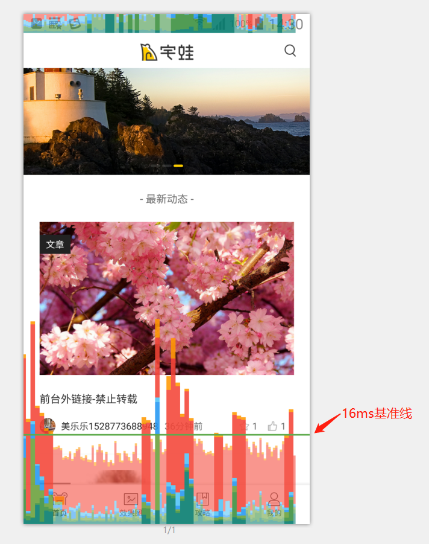
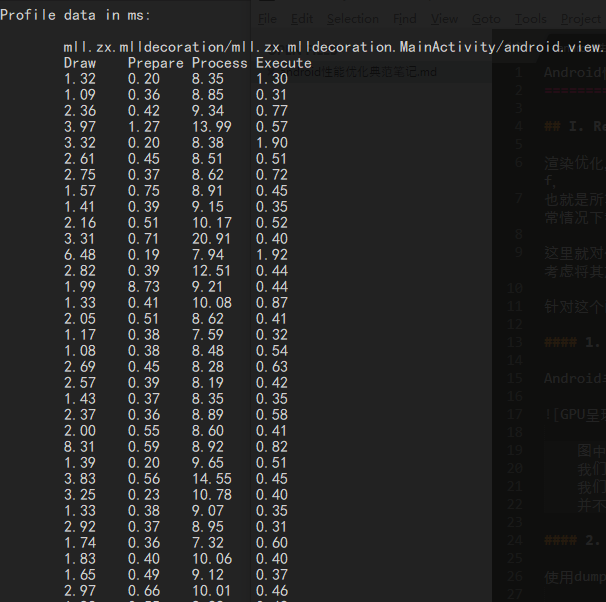
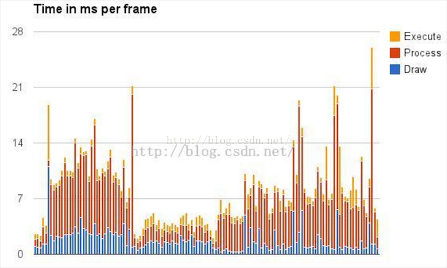
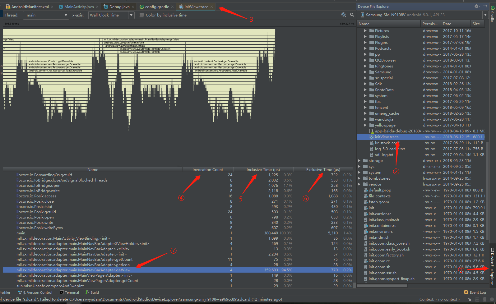
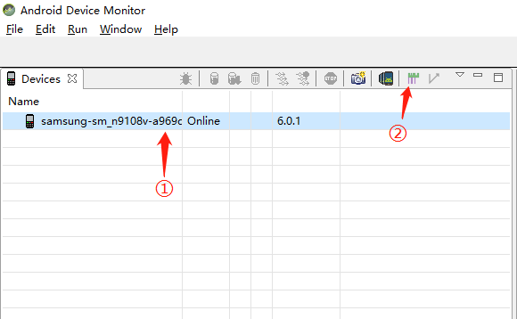
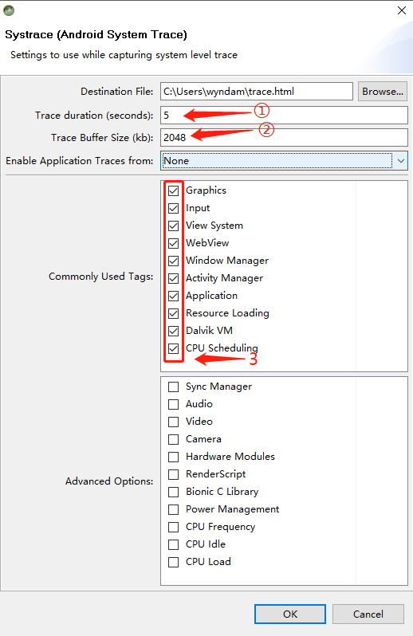
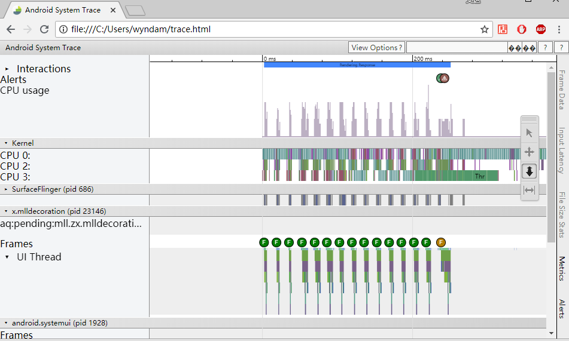

Android性能优化典范笔记（1）-GPU绘制性能优化
====================================

渲染优化，通常情况下我们看到的显示屏的刷新率都是60Hz，也就是通常说的60帧，反过来计算，每一帧的绘制间隔是1000/60=16.67ms/f，
也就是所16.67ms是每一帧的理想刷新时间，但是60Hz是一个理想值，人眼能够识别的最低帧率为24帧，低于这个帧数就会明显感到卡顿，通常情况下我们都会要求最低30帧，为了让app达到体验的极佳性能，还是经可能满足每一帧16.67ms的刷新间隔。

这里就对代码又比较高的要求，你的代码里不能将耗时的操作放在ui线程，即便是不怎么耗时的操作，但是超过了ui刷新的这个阈值，也应当考虑将其放在非ui线程中。

针对这个问题优化我们可以使用android为我们提供的工具查看GPU性能。这些工具包括以下几种：

#### 1. GPU呈现模式分析

Android手机的开发者模式中自带的这个GPU分析工具，可以查看GPU绘制情况，我们先来看下预览图：



```text
图中的绿线即位参考标准，很显然在多数情况下，我们看到GPU绘制时间都没有超过基准线，
我们要使应用达到全程流畅的体验我们就需要对这些超过基准线很多的情况进行优化。
我们从这个图中只能大致的分析出那些界面(Activity/Fragment)出现卡顿的情况，
并不能精准定位到代码中那部分造成卡顿的位置，我们还需要配合使用其他工具来定位具体问题。
```

#### 2. dumpsys

使用dumpsys导出日志文件，然后使用表格将数据转化为图表：

```cmd
$ adb shell dumpsys gfxinfo <package>
```



**用excel做成表格后分析数据**



这种方式其实与**GPU呈现模式分析**功能基本一致，只是提供一种非ui的方式获得数据，然后定量的分析数据。


#### 3. TraceView函数耗时

TraceView是android为我们提供的一个函数调用时常分析工具，使用方法也很简单：

```java
// 在Application中的onCreate方法调用启动trace方法
Debug.startMethodTracing("initView"); // 方法中指定一个保存log的文件名，最终生成的log在手机的 /sdcard/initView.trace 中

// 在合适的时机，例如MainActivity的onDestory方法中, 停止trace
Debug.stopMethodTracing();
```

添加如上的代码后，打开app运行一段时间，然后关闭app，你就可以在sd卡中看到生成的日志文件，Android Studio为我们提供了很方便的分析工具，***.trace**文件可直接在Android Studio中打开，双击打开即可查看耗时详情。


(如果图片看不清，你可以将图片下载下来，markdown不太好调整图片)

```text
1 Device File Expolre 设备文件查看器，查看手机中的文件
2 找到你命名的traceview文件名称，双击打开
3 我们就可以在android studio中直接查看trace文件的内容了
4 Invocation Count 函数调用次数（点击tab可以做升降排序）
5 Inclusive Time 函数运行的时间，包含其他函数占用的时间（点击tab可以做升降排序）
6 Exclusive Time 函数运行的时间，不包含其他函数占用的时间（点击tab可以做升降排序）
7 这里可以看到对应的报名下某个函数的运行状况
```

下面我们就上图中的**7**这个函数开始做一次demo分析：

```
mll.zx.mlldecoration.adapter.main.MainNavBarAdapter.getView
```

这个说的其实并不是某个方法，他是告诉你，你的这个类做了什么操作导致耗时。

```java
// MainNavBarAdapter.java
/**
 * Created by zhangwenda on 2018/3/14.
 */

public class MainViewPagerAdapter extends FragmentPagerAdapter {

	// 我们为了省事一般在FragmentPagerAdapter中定义静态的fragments列表，需要的时候直接拿来用。
	// 实际上这样的方式是不合理的，这样会一次创建大量的fragment，并发过高，我们需要将并发合理
	// 分配到真正需要创建的地方。
//    private BaseFragmentEx[] mFragments = {
//            HomeFragment.newInstance(),
//            EffectFragment.newInstance(),
//            StrategyFragment.newInstance(),
//            UserCenterFragment.newInstance()
//    };

    private FragmentManager mFragmentManager;

    public MainViewPagerAdapter(FragmentManager fm) {
        super(fm);
        this.mFragmentManager = fm;
    }

    // 这里从adapter的原理来看，确实将创建分散到了需要的时候，但是，我们忘了ViewPager一个重要的方法
    // {@link ViewPager#setOffscreenPageLimit(int)}这个方法会设置ViewPager的缓存Pager数量，
    // 如果这个缓存数量大于1那么我们如下的操作实际上并不会分散创建压力，跟上面的写法没什么区别。
    // （具体还是有点区别，跟fragment生命周期有关，这里创建就不会造成fragment无法与activity关联的问题）
    @Override
    public Fragment getItem(int position) {
        switch (position) {
            case 0:
                return HomeFragment.newInstance();
            case 1:
                return EffectFragment.newInstance();
            case 2:
                return StrategyFragment.newInstance();
            case 3:
                return UserCenterFragment.newInstance();
        }
        return null;
    }

    // 省略部分非关键代码
}
```

从代码我们可以看出，我们的这个FragmentPagerAdapter，为了给ViewPager提供View的Provider，必然会创建view，
再从我们上面说的创建fragment太过集中的问题，可以得出结论我们需要将fragment创建延迟，具体操作方法，请查看这个传送门：

https://www.jianshu.com/p/8a772b9df6d5

一个类似微信的延迟加载fragment方法，不是单纯的将加载数据延迟，要将创建view也延迟才能分散压力，具体操作可以见连接。

**上面介绍了TraceView的基本用法，和分析流程，详细的使用还要各位读者自己研究，学无止境。**

#### 4. Systrace

Systrace是Android4.1中新增的性能数据采样和分析工具。它可帮助开发者收集Android关键子系统（如surfaceflinger、WindowManagerService等Framework部分关键模块、服务）的运行信息，从而帮助开发者更直观的分析系统瓶颈，改进性能。Systrace的功能包括跟踪系统的I/O操作、内核工作队列、CPU负载以及Android各个子系统的运行状况等。在Android平台中，它主要由3部分组成：

+ 内核部分：Systrace利用了Linux Kernel中的ftrace功能。所以，如果要使用Systrace的话，必须开启kernel中和ftrace相关的模块。
+ 数据采集部分：Android定义了一个Trace类。应用程序可利用该类把统计信息输出给ftrace。同时，Android还有一个atrace程序，它可以从ftrace中读取统计信息然后交给数据分析工具来处理。
+ 数据分析工具：Android提供一个systrace.py（python脚本文件，位于Android SDK目录/tools/systrace中，其内部将调用atrace程序）用来配置数据采集的方式（如采集数据的标签、输出文件名等）和收集 ftrace统计数据并生成一个结果网页文件供用户查看。

从本质上说，Systrace是对Linux Kernel中ftrace的封装。Android 4.1为系统中的几个关键进程和模块都添加了Systrace功能。


**如何使用 Systrace**

这里所有跟工具相关的操作都是基于命令行或Android Studio亦或sdk tools，如果你还在使用eclipse，请尽快升级吧。

Systrace在各个平台上的使用流程基本是一样的：
(1)手机准备好你要进行抓取的界面
(2)点击开始抓取（命令行的话就是开始执行命令）
(3)手机上开始操作
(4)设定好的时间到了之后，会将生成Trace文件，使用Chrome将这个文件打开进行分析

"~"代表你的Android SDK安装路径，进入**~/tools/**目录下运行```monitor.bat```等待监视器打开。



```text
1. 选择要trace的设备
2. 点击systrace图标，进行trace配置
```



```text
1. 输入trace时长
2. 输入缓冲日志大小
3. 选择要trace的信息
```

最上方可以看到我们配置输出的html的地址，找到这个文件使用chrome打开，就会生成对应的性能分析图：



这里我们重点关注我们自己的进程，图中的进程(pid 23146)，右边的F就是每一帧的运行状况，绿色则为正常帧没有超过16.6ms的帧，黄色或者红色即位问题帧，这时候再配合TraceView使用查看耗时的原因。
