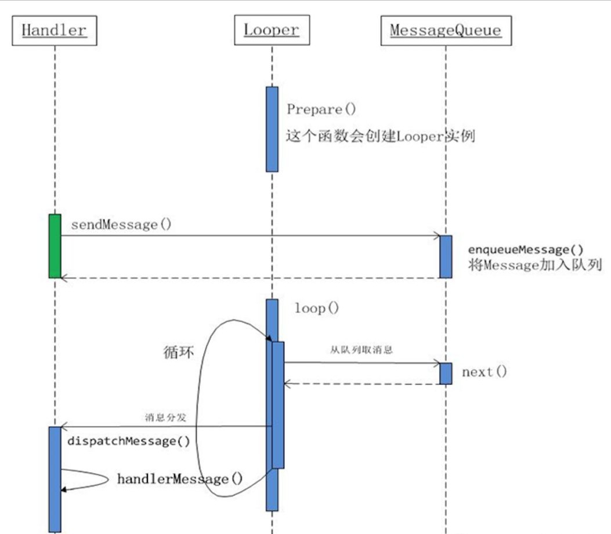
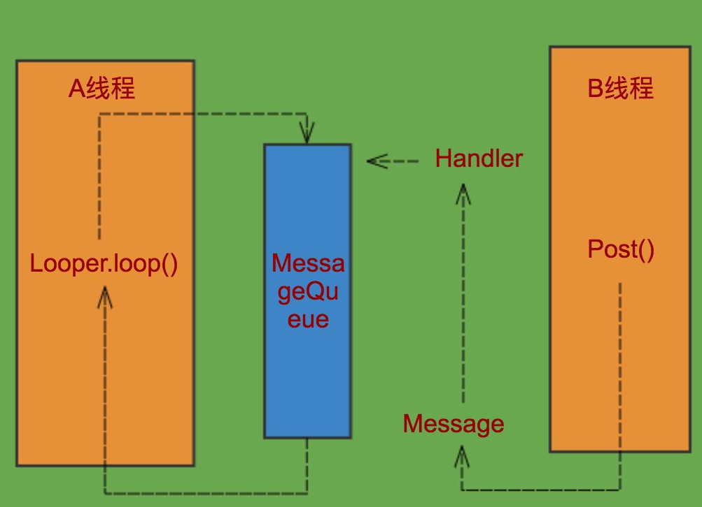

OPPO 高级 Android 开发面试题汇总
===============================

## 一、 Android 基础

### 1. Service 的两种启动方式

简单的来说就是 **直接启动** 和 **绑定启动** 两种方式。

```java
// 直接启动
Context.startService()

// 直接启动后需要手动调用停止服务才会停止
Context.stopService()
Service.selfStop()
```

```java
// 绑定启动
Context.bindService()
```

两种启动方式的生命周期不同，下面詳細说明下生命周期。

官方生命周期图如下：


从上图可以看出，无论是哪种启动方式，都会调用 onCreate 方法，服务第一次创建时会调用该方法，以后再调用 ```startService``` 也不会调用 ```onCreate``` 方法，这里面适合做初始化操作。当处于激活状态时，由 ```startService``` 启动 Service 需要自己停止或者外部客户端停止服务；由 ```bindService``` 启动的服务，当所连接的客户端都调用 ```unbindService``` 后停止。

根据不同的使用场景选择合适的启动方式，例如音乐播放器需要后台播放以及 widget 控制播放这时候就要使用 ```startService``` 启动服务，在用户退出应用的时候结束服务。再比如，某个 Service 的作用范围只在某个 activity 或几个 activity中时，使用bindService方式会比较合适。

#### 题外话：Service 保活

1. 在 onStartCommand 中返回 START_STICKY

这种方式并不能保证 Service 不被杀死，只是提高 Service 被杀死后快速重启概率。

2. 提高 Service 优先级

3. 设置为前台服务

在service中设置常驻通知栏，这样服务就可以在后台常驻，但是通知栏会显示一个通知。

4. 双进程守护

为后台常驻 Service 设置守护进程，相互监听对方的状态，当监测到对方被杀死后立即重启对方 Service 达到守护 service 的目的。

上述方法中通常情况下只能在原声 Android 中实现，国内修改过的系统为了让系统有更好的续航通常都会阻止应用自启动，因此上述方法基本失效。

关于上述方法失效问题很多人会换一种方式解决这个问题，通过第三方推送sdk启动应用，例如 友盟、极光等。具体操作方法就是在自定义推送中启动我们应用的后台服务从而启动应用。具体使用中发现也只能在部分系统中生效，flyme，miui杜绝了这种全家桶式的自启动方式。

终极解决办法，通过微信服务号向用户推送关键信息并通过浏览器打开应用。微信服务号的推送不能滥用，滥用微信会停止服务号的推送功能。

其他相关文章：

[Android Service两种启动方式详解（总结版）](https://www.jianshu.com/p/4c798c91a613)

[Service的两种启动方式](https://www.jianshu.com/p/8a1bdb5062f6)

### 2. IntentService原理分析

普通 Service 在未指定进程的情况下和主线程运行在同一进程，并且也在主线程中，因此在这样的 Service 中做过多耗时操作也会阻塞UI线程。


这种情况下如果我们不想出现跨进程的情况，我们就不能指定 Service 在独立的进程中，我们可以在 Service 中创建 Thread 来处理这些耗时的操作，Android官方给我们提供了一种便利的方式，我们只需要继承IntentService即可，IntentService 会自动我们的操作创建 Thread 并执行。具体实现如下：

```java
public abstract class IntentService extends Service {
    private volatile Looper mServiceLooper;
    private volatile ServiceHandler mServiceHandler;
    private String mName;
    private boolean mRedelivery;

    private final class ServiceHandler extends Handler {
        public ServiceHandler(Looper looper) {
            super(looper);
        }

        @Override
        public void handleMessage(Message msg) {
            onHandleIntent((Intent)msg.obj);
            stopSelf(msg.arg1);
        }
    }

    /**
     * Creates an IntentService.  Invoked by your subclass's constructor.
     *
     * @param name Used to name the worker thread, important only for debugging.
     */
    public IntentService(String name) {
        super();
        mName = name;
    }

    /**
     * Sets intent redelivery preferences.  Usually called from the constructor
     * with your preferred semantics.
     *
     * <p>If enabled is true,
     * {@link #onStartCommand(Intent, int, int)} will return
     * {@link Service#START_REDELIVER_INTENT}, so if this process dies before
     * {@link #onHandleIntent(Intent)} returns, the process will be restarted
     * and the intent redelivered.  If multiple Intents have been sent, only
     * the most recent one is guaranteed to be redelivered.
     *
     * <p>If enabled is false (the default),
     * {@link #onStartCommand(Intent, int, int)} will return
     * {@link Service#START_NOT_STICKY}, and if the process dies, the Intent
     * dies along with it.
     */
    public void setIntentRedelivery(boolean enabled) {
        mRedelivery = enabled;
    }

    @Override
    public void onCreate() {
        // TODO: It would be nice to have an option to hold a partial wakelock
        // during processing, and to have a static startService(Context, Intent)
        // method that would launch the service & hand off a wakelock.

        super.onCreate();
        HandlerThread thread = new HandlerThread("IntentService[" + mName + "]");
        thread.start();

        mServiceLooper = thread.getLooper();
        mServiceHandler = new ServiceHandler(mServiceLooper);
    }

    @Override
    public void onStart(@Nullable Intent intent, int startId) {
        Message msg = mServiceHandler.obtainMessage();
        msg.arg1 = startId;
        msg.obj = intent;
        mServiceHandler.sendMessage(msg);
    }

    /**
     * You should not override this method for your IntentService. Instead,
     * override {@link #onHandleIntent}, which the system calls when the IntentService
     * receives a start request.
     * @see android.app.Service#onStartCommand
     */
    @Override
    public int onStartCommand(@Nullable Intent intent, int flags, int startId) {
        onStart(intent, startId);
        return mRedelivery ? START_REDELIVER_INTENT : START_NOT_STICKY;
    }

    @Override
    public void onDestroy() {
        mServiceLooper.quit();
    }

    /**
     * Unless you provide binding for your service, you don't need to implement this
     * method, because the default implementation returns null.
     * @see android.app.Service#onBind
     */
    @Override
    @Nullable
    public IBinder onBind(Intent intent) {
        return null;
    }

    /**
     * This method is invoked on the worker thread with a request to process.
     * Only one Intent is processed at a time, but the processing happens on a
     * worker thread that runs independently from other application logic.
     * So, if this code takes a long time, it will hold up other requests to
     * the same IntentService, but it will not hold up anything else.
     * When all requests have been handled, the IntentService stops itself,
     * so you should not call {@link #stopSelf}.
     *
     * @param intent The value passed to {@link
     *               android.content.Context#startService(Intent)}.
     *               This may be null if the service is being restarted after
     *               its process has gone away; see
     *               {@link android.app.Service#onStartCommand}
     *               for details.
     */
    @WorkerThread
    protected abstract void onHandleIntent(@Nullable Intent intent);
}
```

从上面的源码中我们可以看出 IntentService 使用了 Handler 来处理发送过来的任务，调用 ```startService``` 后首先会进入 ```onStartCommand``` 接着我们看到 ```onStart``` 方法中将 intent 封装成 Message 丢给 handler ，handler 中的 handleMessage 方法调用 onHandleIntent，我们只需要在 onHandleIntent 完成我们要做的操作即可。 我们看到 onHandleIntent 有一个自定义的注解 ```@WorkerThread```, 添加了该注解的方法系统会自动为我们创建一个线程然后再执行 onHandleIntent 方法。

因此，IntentService 中的消息是依次执行的，如果有很多任务并发执行，这些任务都会放在消息队列中，等待前一个任务执行完成后才能执行下一个任务。

相关文章：

[Android中IntentService实现原理详解](https://blog.csdn.net/woshizisezise/article/details/79939270)

[IntentService的原理和实例分析](https://www.jianshu.com/p/4dd46616564d)

### 3. 静态广播和动态广播的区别？

静态广播需要在 androidManifest.xml 文件中申明组件，否则无法接收广播；
动态广播需要在运行的时候动态注册，有很多系统广播只能用动态注册的方式使用。

1. 动态注册的广播永远要快于静态注册的广播,不管静态注册的优先级设置的多高,不管动态注册的优先级有多低
2. 生存期，静态广播的生存期可以比动态广播的长很多，因为静态广播很多都是用来对系统时间进行监听，比如我们可以监听手机开机。而动态广播会随着context的终止而终止
3. 动态广播无需在AndroidManifest.xml中声明即可直接使用，也即动态；而静态广播则需要，有时候还要在AndroidManifest.xml中加上一些权限的声明

### 4. android 消息机制

图就不画了，博客上找了几张，上图：



上面这张图说明了Handler中的消息循环机制：

1. Handler 消息处理器
2. Looper 消息泵，在消息队列中循环读取消息
3. MesageQueue 消息队列，存放消息
4. Message 消息体

老生常谈了，Handler 通过 sendMessage 向消息队列中发送消息，Looper 循环从 MessageQueue 中取出消息，然后要求 Handler dispatchMessage ，最后回调到 handleMessage 中。从结构上来看简单的就是这么描述。



上图中很明确的说明了，Looper是属于某个一线程的，在android中我们知道要在某个线程中创建 Handler 首先需要初始化 Looper，否则就会报错。下面我们说几条结论，稍后通过源码证明：

1. 一个线程只能有且仅有一个Looper
2. 在线程中创建 Handler 前需要先初始化 Looper

```java
// ActivityThread.java

public static void main(String[] args) {
    Trace.traceBegin(Trace.TRACE_TAG_ACTIVITY_MANAGER, "ActivityThreadMain");

    // CloseGuard defaults to true and can be quite spammy.  We
    // disable it here, but selectively enable it later (via
    // StrictMode) on debug builds, but using DropBox, not logs.
    CloseGuard.setEnabled(false);

    Environment.initForCurrentUser();

    // Set the reporter for event logging in libcore
    EventLogger.setReporter(new EventLoggingReporter());

    // Make sure TrustedCertificateStore looks in the right place for CA certificates
    final File configDir = Environment.getUserConfigDirectory(UserHandle.myUserId());
    TrustedCertificateStore.setDefaultUserDirectory(configDir);

    Process.setArgV0("<pre-initialized>");

    Looper.prepareMainLooper();

    // Find the value for {@link #PROC_START_SEQ_IDENT} if provided on the command line.
    // It will be in the format "seq=114"
    long startSeq = 0;
    if (args != null) {
        for (int i = args.length - 1; i >= 0; --i) {
            if (args[i] != null && args[i].startsWith(PROC_START_SEQ_IDENT)) {
                startSeq = Long.parseLong(
                        args[i].substring(PROC_START_SEQ_IDENT.length()));
            }
        }
    }
    ActivityThread thread = new ActivityThread();
    thread.attach(false, startSeq);

    if (sMainThreadHandler == null) {
        sMainThreadHandler = thread.getHandler();
    }

    if (false) {
        Looper.myLooper().setMessageLogging(new
                LogPrinter(Log.DEBUG, "ActivityThread"));
    }

    // End of event ActivityThreadMain.
    Trace.traceEnd(Trace.TRACE_TAG_ACTIVITY_MANAGER);
    Looper.loop();

    throw new RuntimeException("Main thread loop unexpectedly exited");
}
```

主线程中我们未做 Looper 初始化是因为在 main 函数中系统已经帮我们做了初始化；


通常情况下我们是这样创建 Handler 的：

```java
new Handler();
```

构造函数中没有参数，我们看下最终的构造函数如下：

```java
// Handler.java

public Handler(Callback callback, boolean async) {
    if (FIND_POTENTIAL_LEAKS) {
        final Class<? extends Handler> klass = getClass();
        if ((klass.isAnonymousClass() || klass.isMemberClass() || klass.isLocalClass()) &&
                (klass.getModifiers() & Modifier.STATIC) == 0) {
            Log.w(TAG, "The following Handler class should be static or leaks might occur: " +
                klass.getCanonicalName());
        }
    }

    mLooper = Looper.myLooper();
    if (mLooper == null) {
        throw new RuntimeException(
            "Can't create handler inside thread " + Thread.currentThread()
                    + " that has not called Looper.prepare()");
    }
    mQueue = mLooper.mQueue;
    mCallback = callback;
    mAsynchronous = async;
}
```

可以看到 mLooper 是通过 Looper.myLooper(); 获得的，继续往下看：


```java
// Looper.java

public final class Looper {

    // sThreadLocal.get() will return null unless you've called prepare().
    static final ThreadLocal<Looper> sThreadLocal = new ThreadLocal<Looper>();

    public static void prepare() {
        prepare(true);
    }

    private static void prepare(boolean quitAllowed) {
        if (sThreadLocal.get() != null) {
            throw new RuntimeException("Only one Looper may be created per thread");
        }
        sThreadLocal.set(new Looper(quitAllowed));
    }

    public static @Nullable Looper myLooper() {
        return sThreadLocal.get();
    }

    /**
     * Run the message queue in this thread. Be sure to call
     * {@link #quit()} to end the loop.
     */
    public static void loop() {
        final Looper me = myLooper();
        ...
    }
}
```

myLooper 返回的是 ThreadLocal 中保存的线程贡献变量。

<font color="#ff0000">
**```ThreadLocal``` 是用于保存线程共享变量的类，对它进行 set 时候各个线程的变量不会相互影响，```Thread.ThreadLocalMap``` 会给每个线程保存一个线程共享变量。 ```ThreadLocal``` 是切换线程的关键，```ThreadLocal``` 中保存的是当前线程的 ```Looper``` ，```Looper``` 中包含一个线程的消息队列 ```MessageQueue``` ， ```MessageQueue``` 中的 ```Message``` 中又持有 Hanmdler 的引用，当 ```Looper``` 取到 ```Message``` 后，可通过 ```Message``` 关联的 ```Handler``` 直接调用相关函数，由于是 ```Looper``` 调用的 ```Handler``` ，这时候操作 ```Handler``` 的线程就是 ```Looper``` 所在的线程了，这样就做到了线程切换。**

我们再看 ```prepare()``` 函数中做了判断，如果 ```sThreadLocal``` 有值则直接抛出异常，这里限制一个线程只能有一个 ```Looper``` 。
</font>

下面是我纯 Java 环境下实现的模拟 Handler 简单原理：

[模拟Handler实现](https://github.com/onlynight/SimulateHandler)

相关文章：

[Handler是如何实现线程之间的切换的](https://blog.csdn.net/c6E5UlI1N/article/details/79724023)

### 5. 布局

常用布局：

```FrameLayout``` ```LinearLayout``` ```RelativeLayout```

什么情况下使用 ```RelativeLayout``` ：

Google 官方文档有这么一段描述:

    A RelativeLayout is a very powerful utility for designing a user interface because it can eliminate nested 
    view groups and keep your layout hierarchy flat, which improves performance. If you find yourself using 
    several nested LinearLayout groups, you may be able to replace them with a single RelativeLayout.

也就是说为了提高布局性能，当我们过多的布局嵌套的时候我们尝试使用一个 RelativeLayout 来解决多级嵌套问题，从而提高布局性能。


提高性能布局：

```ConstraintLayout```

```ConstraintLayout``` 也是为了解决布局嵌套问题，它比 ```RelativeLayout``` 更加灵活，使用也稍微复杂一些。


相关文章：

[RelativeLayout和LinearLayout性能比较](https://blog.csdn.net/guyuealian/article/details/52162774)

[实战篇ConstraintLayout的崛起之路](https://www.jianshu.com/p/a74557359882)

### 6. 数据库

#### 数据库迁移

数据库升级时版本号最好是连续的，方便使用循环升级，下面我们来看一段代码：

```java
public class DBHelper extends SQLiteOpenHelper {

    private static final int VERSION = 3;

//    private static final String CREATE_RECORDING = "CREATE TABLE IF NOT EXISTS recording(" +
//            "ringing_time,wait_time,call_time,myphone,othrephone,localfilepath,remotefilepath," +
//            "nickname,type,incoming,username,add_time,task_type,test);"; // version 1
//    private static final String CREATE_RECORDING = "CREATE TABLE IF NOT EXISTS recording(" +
//            "ringing_time,wait_time,call_time,myphone,othrephone,localfilepath,remotefilepath," +
//            "nickname,type,incoming,username,add_time,task_type,test,task_id);"; // version 2
    private static final String CREATE_RECORDING = "CREATE TABLE IF NOT EXISTS recording(" +
            "ringing_time,wait_time,call_time,myphone,othrephone,localfilepath,remotefilepath," +
            "nickname,type,incoming,username,add_time,task_type,test," +
            "task_id,close_type,is_connected,is_accepted);"; // version 3

    public DBHelper(Context context) {
        super(context, "mllrecordingwizard.db", null, VERSION);
    }

    @Override
    public void onCreate(SQLiteDatabase db) {
        db.execSQL(CREATE_RECORDING);
    }

    @Override
    public void onUpgrade(SQLiteDatabase db, int oldVersion, int newVersion) {
        String sql;
        for (int i = oldVersion; i < newVersion; i++) {
            switch (i) {
                case 1:
                    sql = "ALTER TABLE recording ADD COLUMN task_id;";
                    db.execSQL(sql);
                    break;
                case 2:
                    sql = "ALTER TABLE recording ADD COLUMN close_type;";
                    db.execSQL(sql);
                    sql = "ALTER TABLE recording ADD COLUMN is_connected;";
                    db.execSQL(sql);
                    sql = "ALTER TABLE recording ADD COLUMN is_accepted;";
                    db.execSQL(sql);
                    break;
            }
        }
    }

    public SQLiteDatabase getSQLiteDatabase() {
        return this.getWritableDatabase();
    }

}
```

上例中数据库初始版本号是1，升级到最新版本号是3。为了能够有迹可循，最好保存每个版本数据库表的设计，如上面的注释。

- 数据库不存在时，只会调用 ```onCreate``` 方法我们在 ```onCreate``` 中创建表即可；
- 数据库已存在时，不会调用 ```onCreate``` 只会调用 ```onUpgrade``` 方法，我们需要在 ```onUpgrade``` 方法中执行升级操作即可。


### 7. ANR出现的情况有几种？ 怎么分析解决ANR问题？

ANR(Application Not responding)。Android中，主线程(UI线程)如果在规定时内没有处理完相应工作，就会出现ANR。具体来说，ANR会在以下几种情况中出现:

1. 输入事件(按键和触摸事件)5s内没被处理
2. BroadcastReceiver的事件(onRecieve方法)在规定时间内没处理完(前台广播为10s，后台广播为60s)
3. service 前台20s后台200s未完成启动
4. ContentProvider的publish在10s内没进行完

分析ANR问题，需要结合Log以及trace文件。具体分析流程，可参照以下两篇文章：

https://www.jianshu.com/p/fa962a5fd939

https://blog.csdn.net/droyon/article/details/51099826

### 8. 列表控件对比

#### ListView 与 RecyclerView 对比：

1. ```ListView``` 使用适配器时需要手动复用 view ，为非必要操作，数据多了以后很容易早晨内存溢出情况； ```RecyclerView``` 通过代码的形式约束，控件自身实现 view 的复用，避免了问题的出现。
2. ```RecyclerView``` 支持布局管理器，布局方式灵活。
3. ```RecyclerView``` 两级缓存
4. ```RecyclerView``` item 动画灵活
5. ```RecyclerView``` adapter 更新更加灵活，可单独更新某个item，不用更新整个列表。

#### RecyclerView 缓存分析

讲解 ```RecyclerView``` 如何进行缓存的文章很多了，分析源码也很到位，图文并茂。这里不再重复造轮子，这里说一下为什么使用多级缓存：

设置多级缓存意义：

- **一级缓存 ```scrap```** 容量最小，只保存最先出屏幕的 ViewHolder ，需要显示是也是首先从一级缓存中取出 ViewHodler
- **二级缓存 ```cacheView```** 二级缓存缓存一级缓存放不下的 ViewHolder
- **三级缓存 ```RecyclerViewPool```** 三级缓存，对象池缓存，多个 RecyclerView 共享缓存。

    <font color="#ff0000">
    **各级缓存容量依次增大，一级缓存使用最频繁不宜很大，一级缓存过大遍历时间长影响效率；二级缓存是一级缓存的补充，为了弥补一级缓存的容量不足；三级缓存是共享缓存，提高应用整体的复用性以及缓存的容量。缓存容量越小命中率越高，但是过于小的缓存并不能起到缓存的作用，所以三级缓存的容量依次增大。**</font>

相关文章：

[一级缓存、二级缓存和三级缓存有什么区别](https://product.pconline.com.cn/itbk/software/dnyw/1707/9624431.html)

[RecyclerView 源码分析(三) - RecyclerView的缓存机制](https://www.jianshu.com/p/efe81969f69d)

[RecyclerView缓存原理](https://blog.csdn.net/weishenhong/article/details/81844514)

### 9. Activity启动模式

- Standard

    在同一个任务栈中可以有多个实例，每次调用 startActivity 都会新建一个实例添加到栈中

- SingleTop

    栈顶复用，若不在栈顶创建一个新的 Activity

- SingleTask

    栈内复用，若栈中已经存在这个 Activity ，那么将其上方的其他 Activity 弹出栈并将其 放到栈顶。相当于栈内单例模式。

- SingleInstance

    进程单例模型，系统中唯一单例存在，单独一个任务栈。

### 10. Touch 事件分发

### 11. TCP/TP

## 二、 开源框架

### 1. 网络框架

#### OkHttp

#### Retrofit

### 2. 图片加载框架

#### Glide

#### Fresco

#### Picasso

### 3. 数据库 ORM 框架

#### GreenDao

#### LitePal

#### OrmDao

#### Realm

### 4. 依赖注入框架

#### ButterKnife

#### Dagger2

#### AndroidAnnotations

### 5. 事件总线框架

#### EventBus

[https://github.com/greenrobot/EventBus](https://github.com/greenrobot/EventBus)

优点：

缺点：

简单的EventBus实现 OwnEventBus：

[https://github.com/onlynight/OwnEventBus](https://github.com/onlynight/OwnEventBus)

```java
/**
 * Created by wyndam on 2017/12/27.
 * simple event bus demo
 */

public class EventBus {

    /**
     * subscribers
     */
    private List<WeakReference<Object>> subscribers;

    private static EventBus instance;

    public static EventBus getInstance() {
        if (instance == null) {
            instance = new EventBus();
        }
        return instance;
    }

    private EventBus() {
        this.subscribers = new ArrayList<>();
    }

    /**
     * register subscriber to event bus
     * @param subscriber event listener
     */
    public void registerSubscriber(Object subscriber) {
        if (subscriber != null) {
            subscribers.add(new WeakReference<>(subscriber));
        }
    }

    /**
     * unregister subscriber from event bus
     * @param subscriber event listener
     */
    public void unregisterSubscriber(Object subscriber) {
        if (subscriber != null) {
            Iterator<WeakReference<Object>> iterator = subscribers.iterator();
            Object obj = null;
            while (iterator.hasNext()) {
                obj = iterator.next();
                if (obj == subscriber) {
                    subscribers.remove(obj);
                    obj = null;
                    break;
                }
            }
        }
    }

    /**
     * post event from other component
     * @param event event data object
     */
    public void post(Object event) {
        if (event instanceof String) {
            LogUtils.D(event);
        }
        dispatchEvent(event);
    }

    /**
     * dispatch event inner
     * @param event event data object
     */
    private void dispatchEvent(Object event) {
        Iterator<WeakReference<Object>> iterator = subscribers.iterator();
        WeakReference<Object> obj;
        while (iterator.hasNext()) {
            obj = iterator.next();

            try {
                Method method = obj.get().getClass().getMethod("onEvent", Object.class);
                method.invoke(obj.get(), event);
            } catch (Exception e) {
                e.printStackTrace();
            }
        }
    }

}
```

关键就是这个 ```WeakReference``` 列表，注册的监听对象都保存在这个列表中，当对象销毁后 ```WeakReference``` 无法继续持有对象引用不会造成内存泄漏问题。然后通过反射的方式找到对象中监听回调的函数，每次 post 消息后回调监听函数。

相关文章：

[EventBus 原理解析](https://www.jianshu.com/p/d9516884dbd4)

### 6. 日志框架

#### Logger

### 7. 性能优化框架

#### LeakCanary

#### ACRA

### 8. 响应式变成框架

#### RxJava

### 9. 其他框架

#### DiskLruCache

#### Mockito

## 三、 Android 进阶

### 1. 多进程

在没有特殊申明的情况下我们应用的所有组件都是在同一个进程下的，只有我们特殊申明应用才能开启多进程。

多进程的好处：

1. 当应用需要很多内存时，我们可以通过添加一个进程来解除系统对应用内存的限制。(慎用，进程的开销远比线程大得多，进程越多占用的内存也就越多，可用的内存就会更少，当系统需要大内存分配的时候就会频繁出现内存回收的情况，内存回收期间总会有一个瞬间所有应用线程暂停等待回收线程回收内存，从而导致系统卡顿。)
2. 多进程增强程序健壮性，例如当UI进程意外终止的时，后台业务进程正常运行能够保证业务更加稳定。

多进程的坏处：

1. 很多代码不再适合多进程，需要重新适配。例如：单例模式，在同一进程中线程可以共享单例；到了多进程中，每个线程中的单例就是不同的单例不能简单的通过 synchronized 来进行同步。
2. 进程间通信需要单独做，增加了进程通信的开销。


#### 如何开启多进程

```androidManifest.xml``` 中设置组件时，添加一个 ```android:process``` 属性，这个属性是指定组件运行的进程名称。

#### 进程间如何通信

1. Intent

    通过Intent直接传递参数给其他进程组件

2. **AIDL** Android Interface Define Language

    我们可以使用 android 为我们提供的 AIDL 来实现进程间的通信。

    AIDL实际上是为我们进程通信的做了简化，我们只需要申明接口即可，然后编写 C/S 两端即可实现通信。实际上我们也可以不通过 AIDL 完成进程间通信，通过继承 Binder 自己编写中间的过程。

    AIDL实际上就是简化Binder通信的工具，Binder通信机制实际是使用进程共享内存实现的进程间通信。

4. ContentProvider

    四大组件之一，为了方便应用间共享数据，底层也是 Binder 实现。

5. Messenger

    AIDL实现

6. Socket

    通过网络编程实现跨进程通信，Socket本来就是异步模型，无论是和远程进程还是本地进程，都是进程通信。

### 2. 超大图加载

### 3. 内存泄露

内存泄露的场景有哪些？内存泄漏分析工具使用方法？

常见的内存泄露有：


- 单例模式引起的内存泄露。
- 静态变量导致的内存泄露。
- 非静态内部类引起的内存泄露。
- 使用资源时，未及时关闭引起内存泄露。
- 使用属性动画引起的内存泄露。
- Webview导致的内存泄露。
- 匿名内部类持有引用未释放。

而对于内存泄露的检测，常用的工具有 LeakCanary 、 MAT（Memory Analyer Tools）  、Android Studio 自带的 Profiler 。

### 4. 启动优化

如何实现启动优化，有什么工具可以使用？

相关文章：

[Android启动速度优化](https://blog.csdn.net/yuanguozhengjust/article/details/80052066)

[Android性能优化 -- Systrace工具](https://blog.csdn.net/Kitty_Landon/article/details/79192377)

[App优化 Systrace](https://www.cnblogs.com/baiqiantao/p/7700511.html)

[Android性能分析工具Systrace和TraceView的使用](https://blog.csdn.net/xiyangyang8/article/details/50545707)

[Systrace的工作原理及例子解读](https://blog.csdn.net/cxq234843654/article/details/74388328)


### 5. 设计模式

常用的设计模式有哪些？是否了解责任链模式？

单例模式，观察者模式，工厂模式，建造者模式，构造者模式，中间者模式，桥接模式，适配器模式等等。

### 6. 线程池

### 7. 内存优化

### 8. 同步以及异步

### 9. 模块化、插件化、组件化

### 10. volatile、synchronized

### 11. 内存模型以及原理

### 12. 对象池

### 13. 开源推送框架

### 14. MVC、MVP、MVVM

### 15. SQLite线程安全

### 16. 网络请求定位异常

### 17. 耗电量优化

### 18. AMS、WMS

相关文章：

[剖析Activity、Window、ViewRootImpl和View之间的关系](https://blog.csdn.net/jiang19921002/article/details/78977560)


## OPPO 面试相关文章

[大厂OPPO面试— Android 开发技术面总结](http://www.jcodecraeer.com/plus/view.php?aid=12576)

[OppoAndroid面试小记](https://www.cnblogs.com/wenjianes/p/10023517.html)

[OPPO Android开发技术面总结](https://www.jianshu.com/p/b110f9c1384c)

[Android 高级架构开发工程师常见的面试题(腾讯,百度,平安,OPPO,招商银行)](https://blog.csdn.net/wolfking0608/article/details/83111340)
